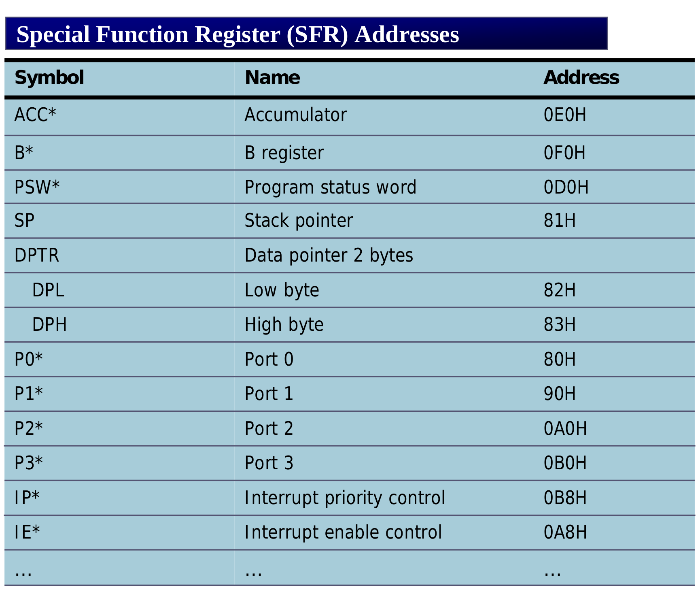
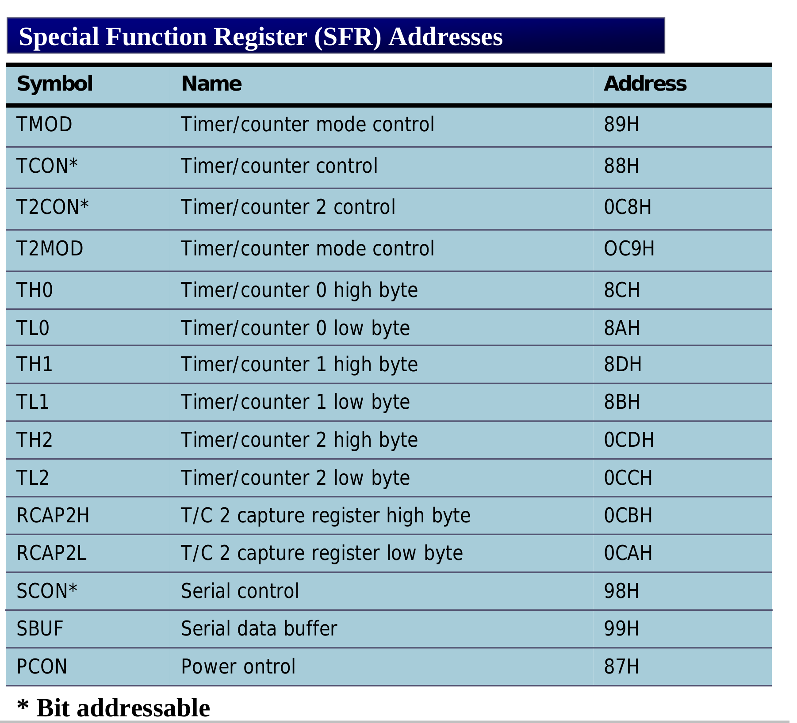
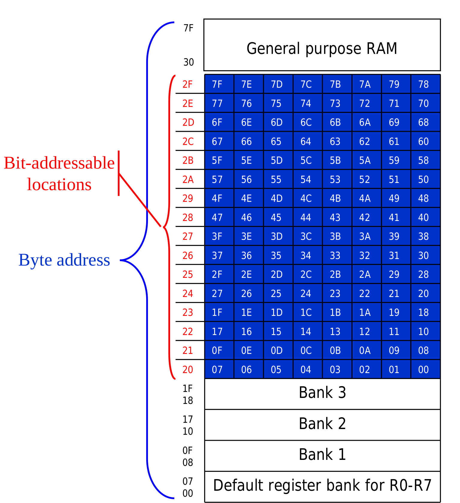

### Addressing Modes {.tabset}

#### Intro


#### SFR
 
( Special Function Registers) [80H - FFH]







* A --> 0E0H
* B --> 0F0H

```Assembly
MOV   0E0H,  #50H
```


#### Bit Addresses
* bit-addressable RAM location is 20-2FH
* P0 -P3 are bit addressable

<!-- ![bit-address1][24] -->




##### single bit instructions


#### Notes

* Only direct addressing mode is allowed for push/poping the Stack

* Pushing the Accumulator onto the state must be coded as
```Assembly
PUSH   0E0H
```
* Indexing addressing is used in accessing data elements of the look-up table entries located the program ROM
```Assembly
MOVC    A,    @A + DPTR
```

#### Exercises
#### Go Back

<a href="../index.html">Index</a>

##
