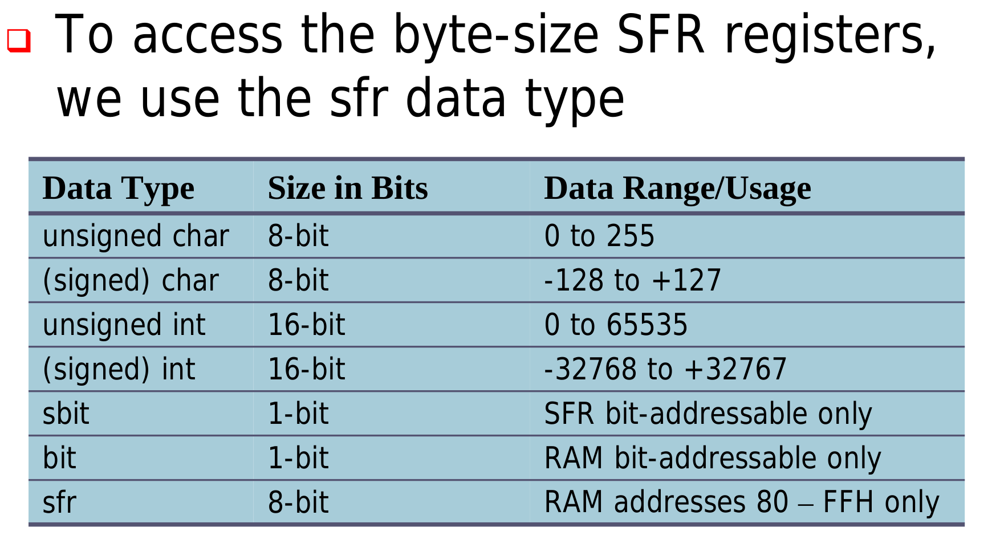
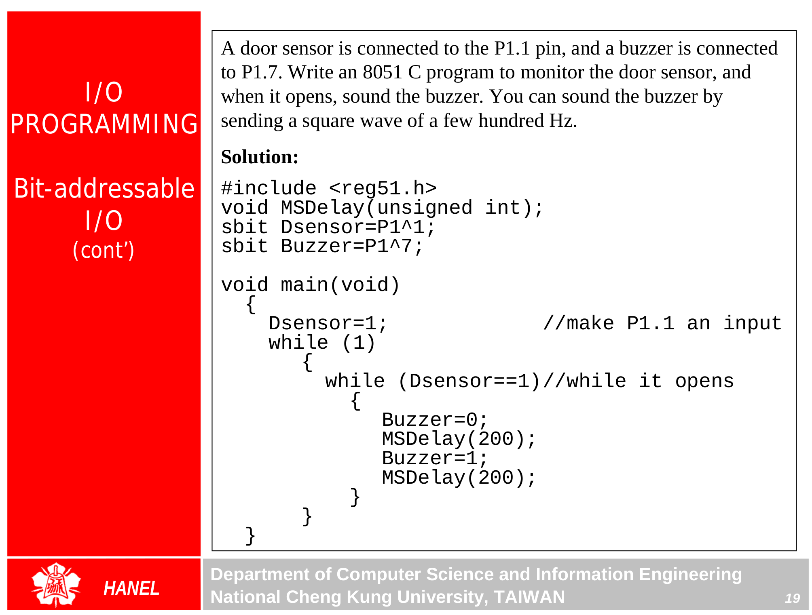

### C in 8051 {.tabset}

#### Intro

#### Notes

* sbit : allows access to signle bits of the SFR register
* loops: can be used as delay (or see timers)

##### Data Types

#### Exercises

#### Go Back

<a href="../index.html">Index</a>

##
