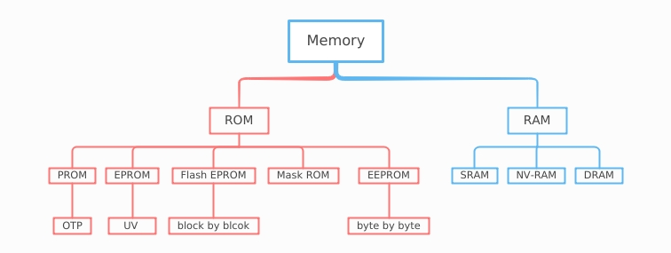
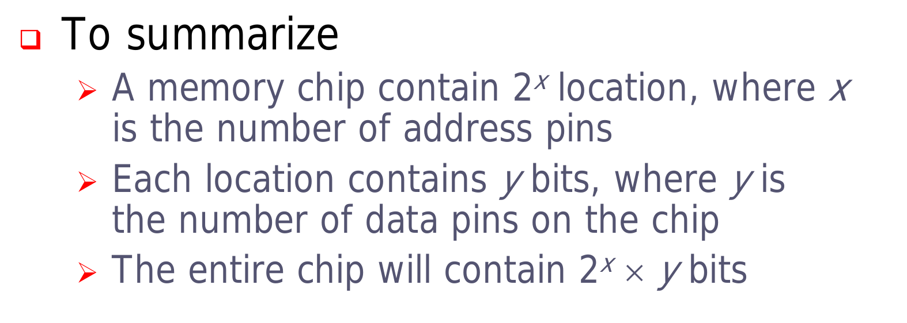
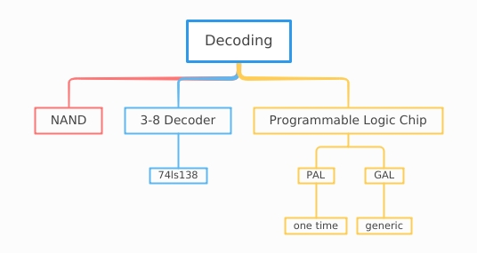
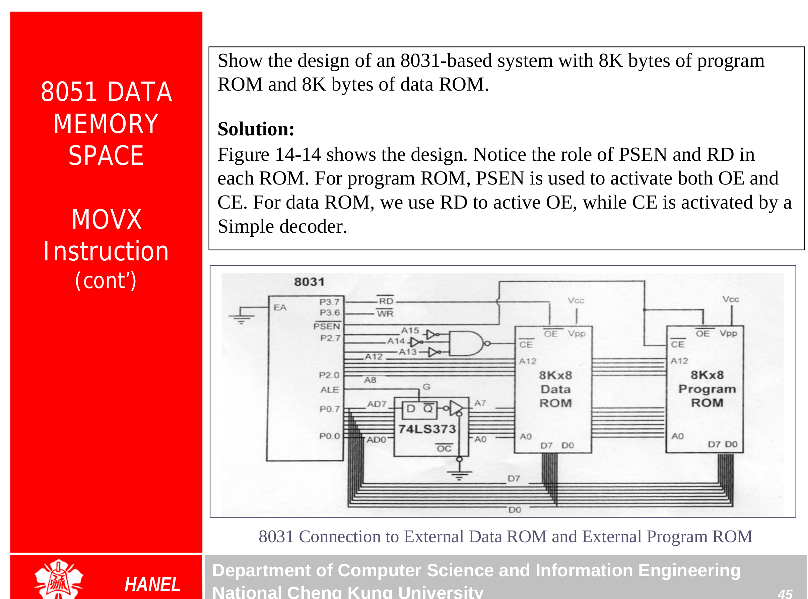
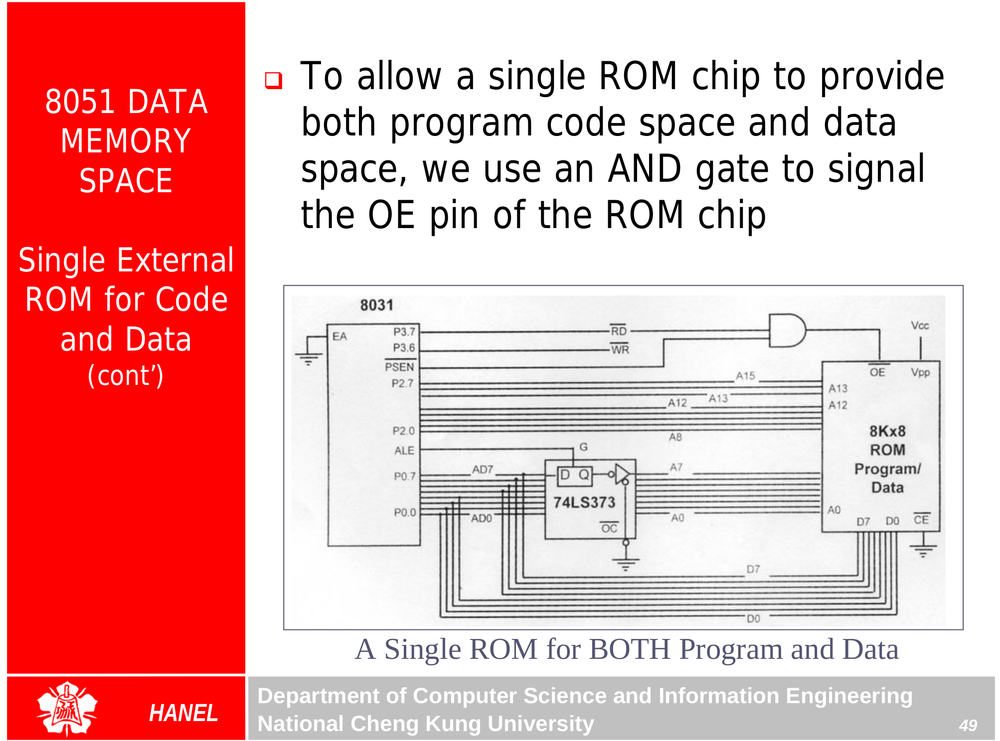
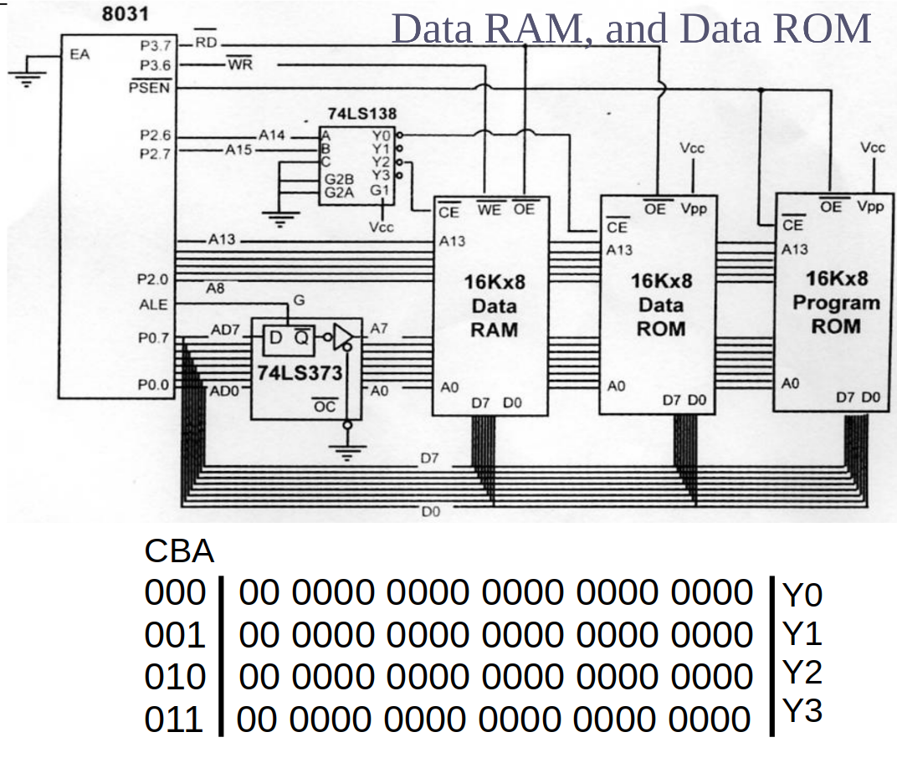
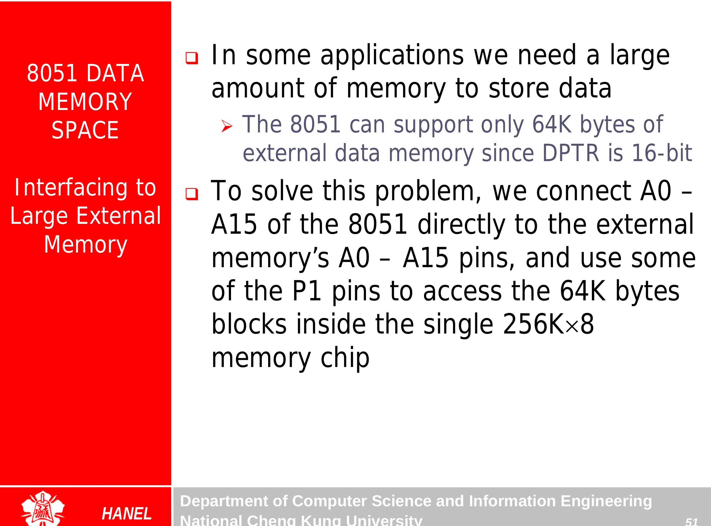

## External Memory {.tabset}

### Intro

### Checksum
check correctness of data
* sum(bytes) + 2's complement(data) must = 0 if no errors

* MOVX : transfers data between the accumulator and external data memory

* For program ROM
  * PSEN is used to activate both OE and CE
* For Data ROM
  * we use RD to activate OE
  * CE is activated by simple decoder

### Decoding

### EA

### Connection

### Notes

* The pattern of IC  [ **27** _128_ - 25 ]
  * 27 -> uv-EPROM
  * 128 -> capacity (Kbits)
  * 25 -> access time (n/10)
* 8751 -> EPROM based
* 89c51 -> Flash based

### Exercises
### Go Back

<a href="../index.html">Index</a>

##
