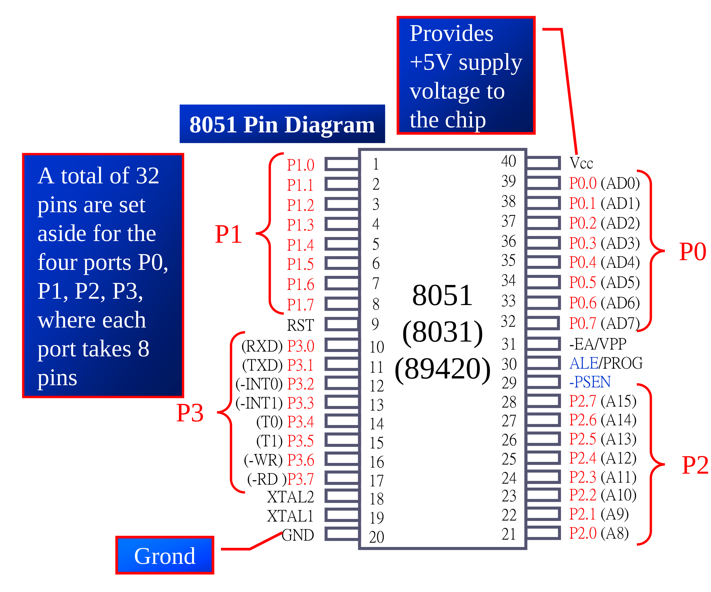
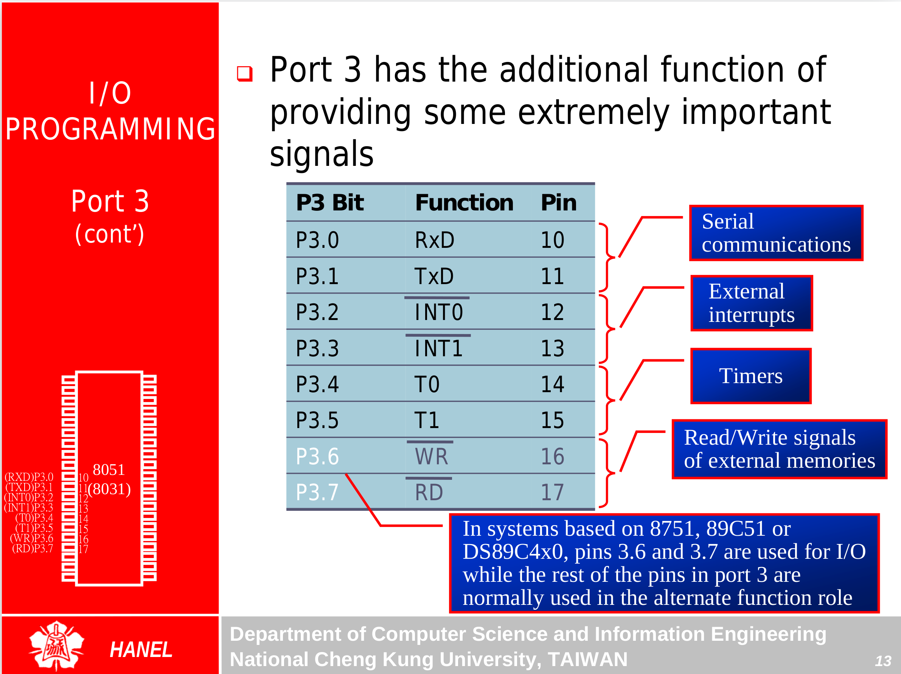
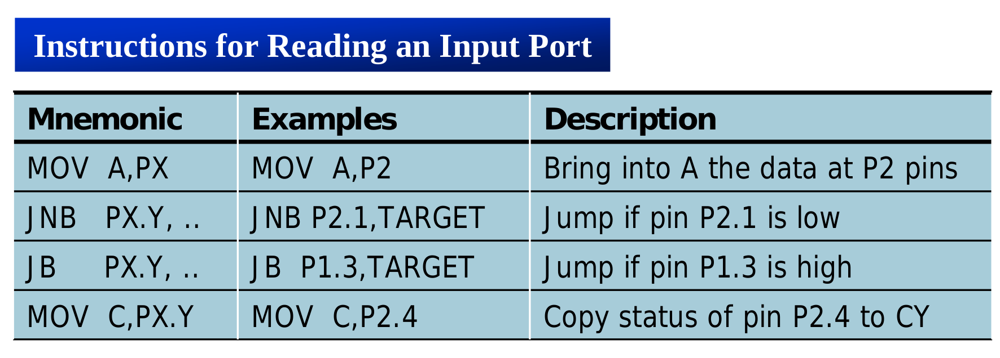
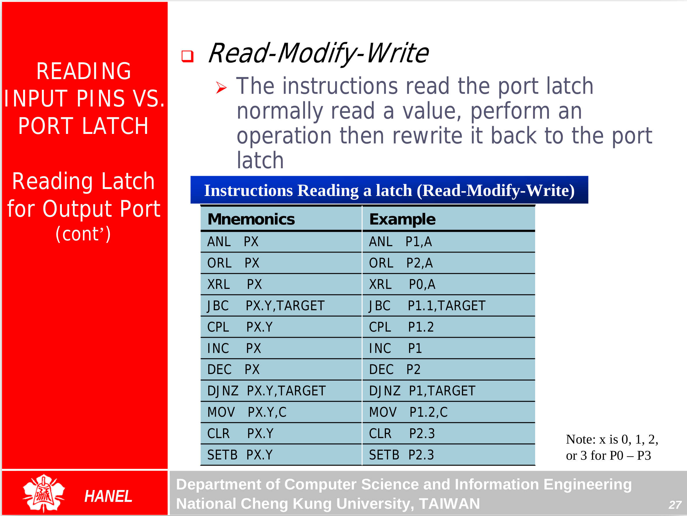
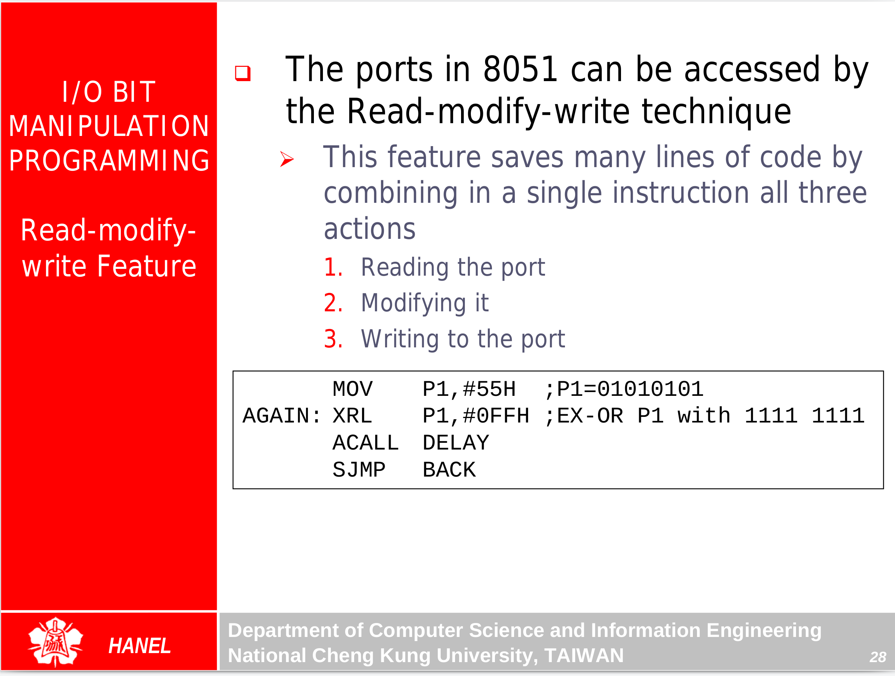

## I/O Programming {.tabset}

### Intro

* 0 : 0utput
* 1:  1nput

* P0 must be connected with 10 kohm pull-up resistor
* P0 is also used for address and data AD0-AD7

### port 3

### Some ISA

### Read-Modify-write

---
### Exercises
### Go Back

<a href="../index.html">Index</a>

##
