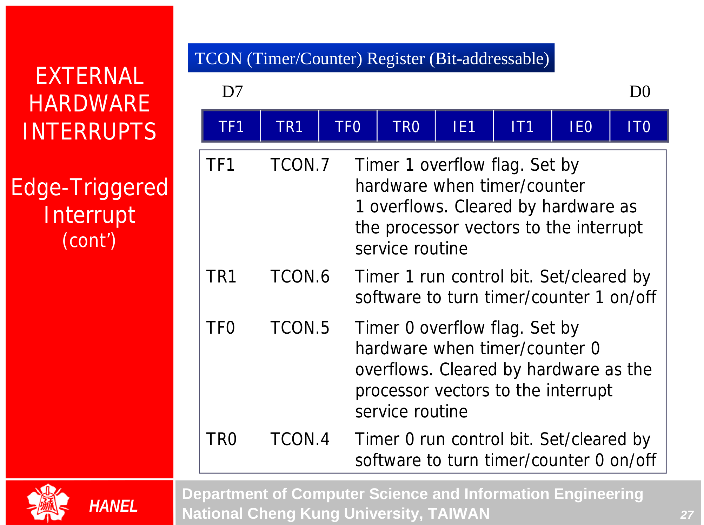
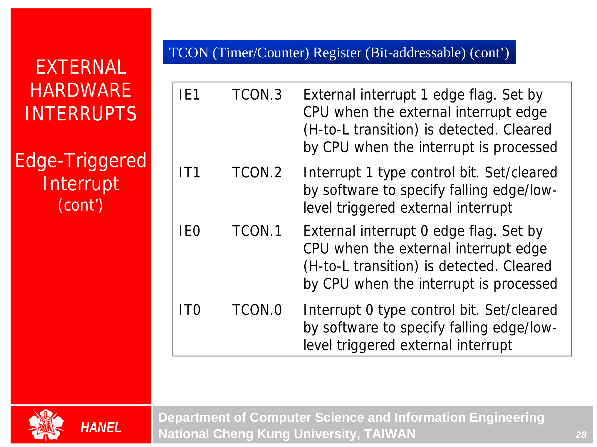
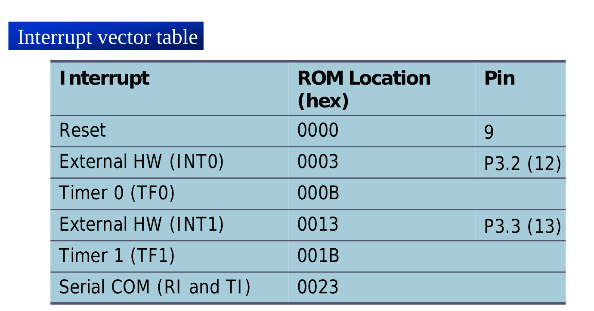
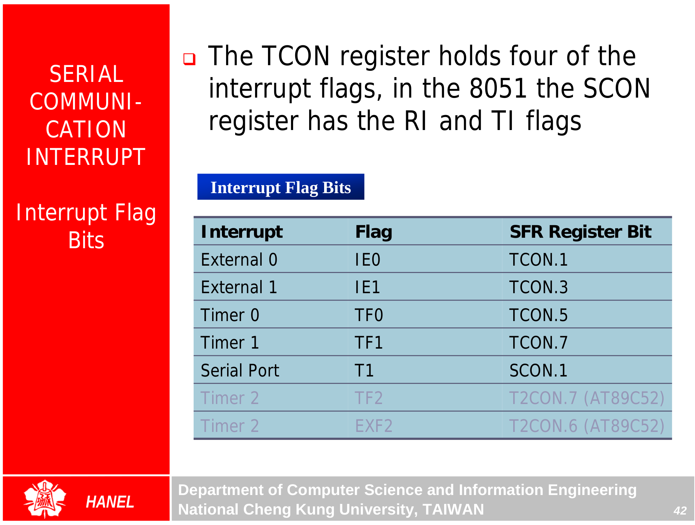
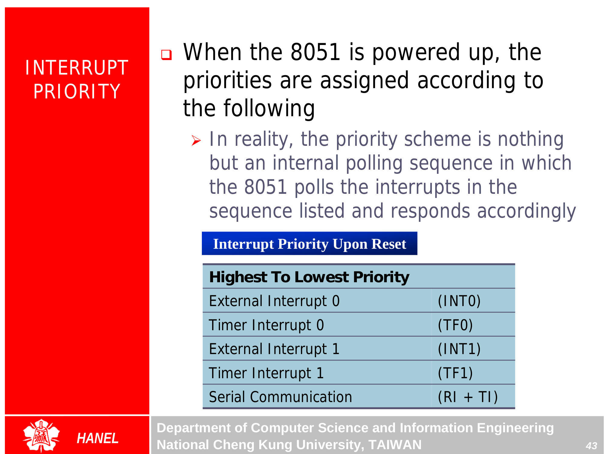
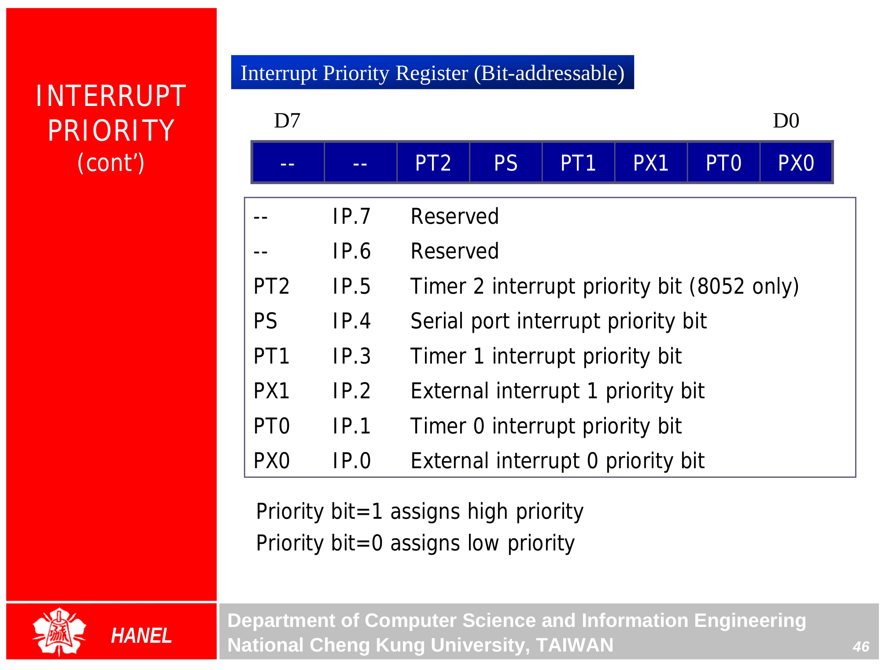

## Interrupts Programming {.tabset}

### Intro

### Notes
* Compare codes with timer programming
> **Recall:** duty cycle = % high portion / overall period  
Avg voltage = operated voltage(5V) * duty cycle

### IE Register

* **TI (transfer Interrupt)**: is raised when the last bit of the frammed data are transfered, indicating that the SBUF register is ready to transfer the next byte

* **RI (Received Interrupt)**: is the raised when the entire frame of the data,including stop bit is received

* In 8051, there is only one interrupt for serial communication
  * TI and RI are ORed
  * When the output is set -> jump tp 0023H ISR
  * Check TI and RI to see which caused the interrupt to respond accordingly
  * The serial interrupt is used mainly for receiving data

### TCON Register

### Interrupt Vector Table

### Interrupt Flag bits

### Interrupt Priority

### Exercises
### Go Back

<a href="../index.html">Index</a>

##