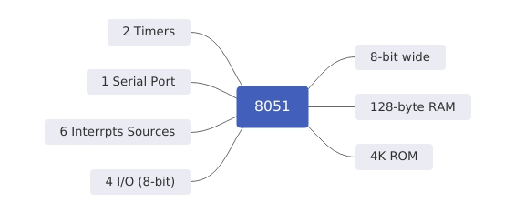

### Basic Introduction {.tabset}

#### Notes

8051 chip:

* 8-bit wide
* 128-byte RAM
* 4K ROM
* 2 Timers
* One Serial Port
* Four I/O (8-bit)
* 6 interrupts sources

#### Registers
|D7|D6|D5|D4|D3|D2|D1|D0|
|:----|:----|:----|:----|:----|:----|:----|:----|
| Most| Significant||bits | Least|Significant||bits|

* **A** : Accumulator [8-bit]
* **B, R0:R7** [8-bit]
* **DPTR (DPH, DPL)** [16-bit]
* **PC** [16-bit]

#### Exercises

#### Go Back

<a href="../index.html">Index</a>

##
