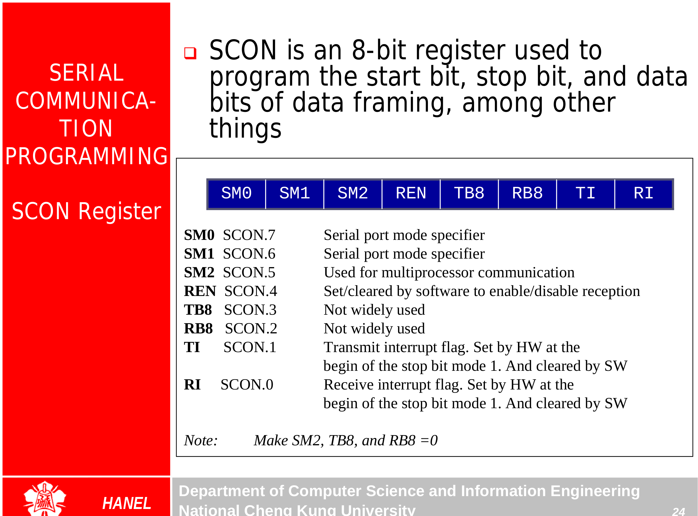

## Serial Communication {.tabset}

### Intro


### Notes
* bps = baud rate (the rate of data transfer)
* Standard interfacing RS232
* MAX232 (convert RS232 to TTL levels) [charge bump]
* MAX233 (same as MAX232 with built-in capacitors)

* Software:
  * Hyperterminal
  * Serialterminal

### RS232


### Registers in Use


```Assembly
MOV   SBUF,  #'D'
MOV   SBUF,  A
MOV   A,     SBUF
```

#### SCON



##### Modes
| SM0 | SM1 |     |
| :---| :---| :---|
| 0   | 0   | Serial Mode 0 (shift register)|
| 0   | 1   | Serial Mode 1 |
| 1   | 0   | Serial Mode 2* (shift register UART)|
| 1   | 1   | Serial Mode 3 (Multiprocessor)|


* Doubling Baud Rate (PCON is not bit addressable)

### Exercises
### Go Back

<a href="../index.html">Index</a>

##