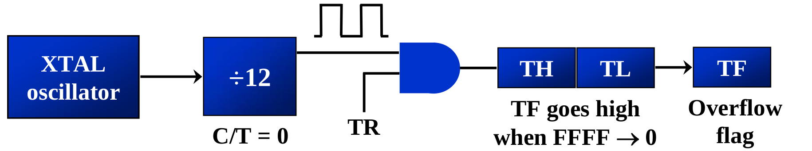
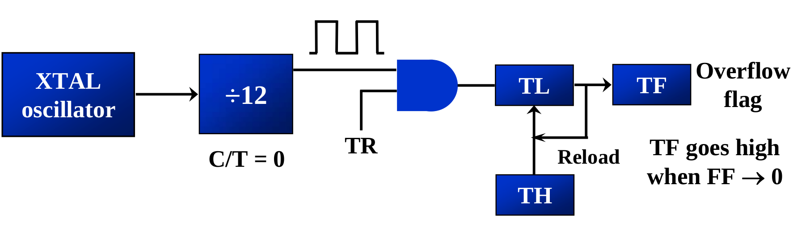
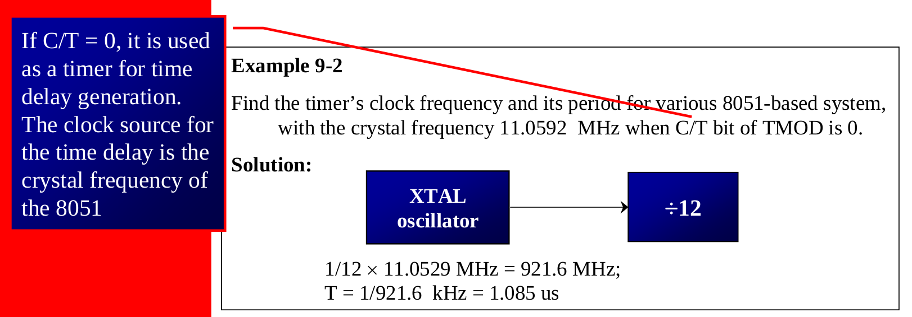
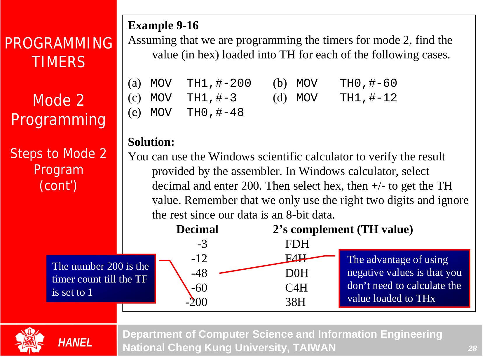

## Timer Programming {.tabset}

### Notes
* 8051 has 2 timers (counters) [T0 , T1]

|D15 - D8|D7-D0|
|:--|:--|
|THx|TLx

```assembly
MOV  TL0,    #4FH
MOV  R5,     TH0
```

* TMOD (timer mode), is used to set the various timer operation modes

|D7|D6|D5|D4|D3|D2|D1|D0|
|:--|:--|:--|:--|:--|:--|:--|:--|
|Gate|C/T'|M1|M0|Gate|C/T'|M1|M0|
|MSB>>|Timer 1|||||Timer 0|<<LSB|

* Gate
  * when set, timer is enabled only while INTx pin is high & TRx control pin is set
  * when cleared, the timer is enabled whenever the TRx control is set

* C/T'
  * cleared for timer (internal clock)
  * set for counter (input for Tx input)

| M1 | M2 | Mode | Operating Mode    |
| :--| :--|:-----| :-----------------|
| 0  | 0  | 0    | 13-bit timer      |
| 0  | 1  | 1    | 16-bit timer*     |
| 1  | 0  | 2    | 8-bit auto reload*|
| 1  | 1  | 3    | Split timer mode  |

* \* our focus






### Exercises



### Go Back

<a href="../index.html">Index</a>

##
